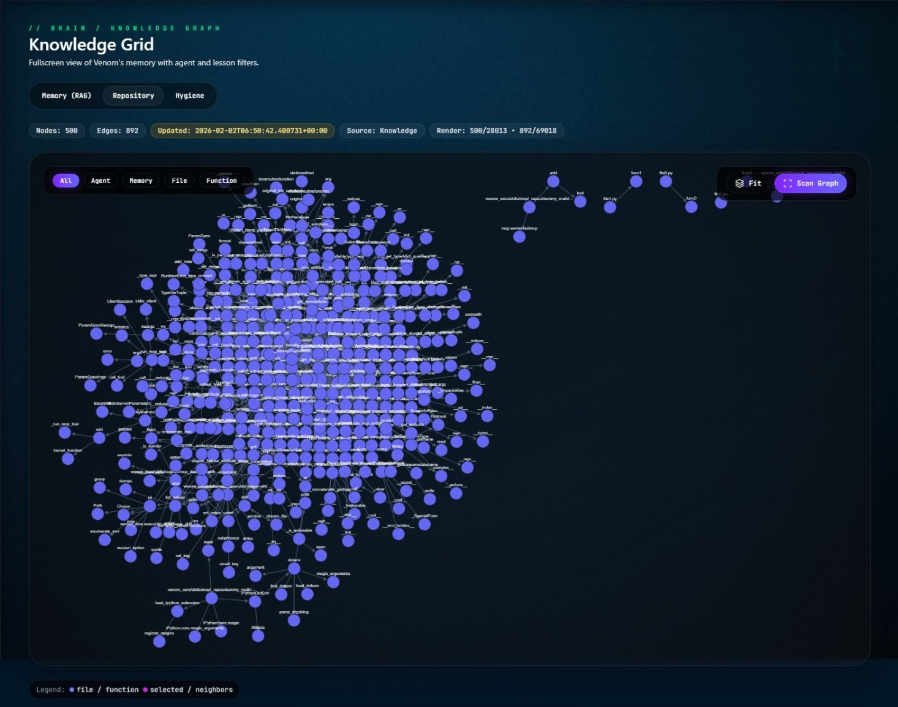
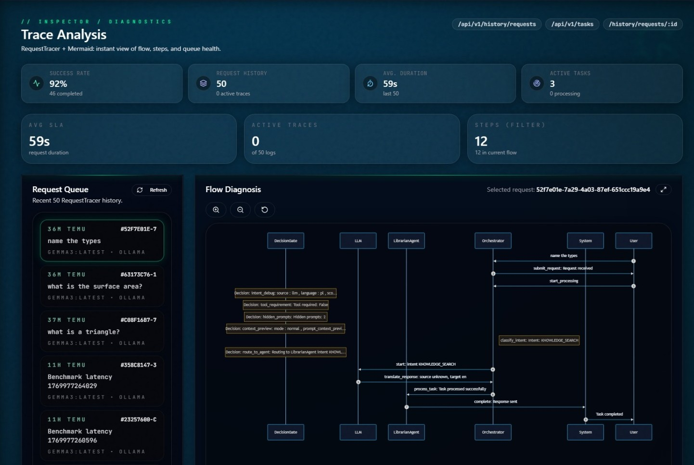
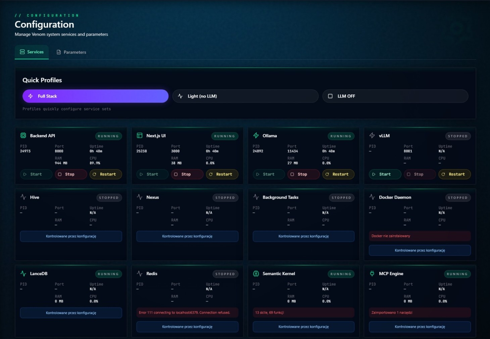
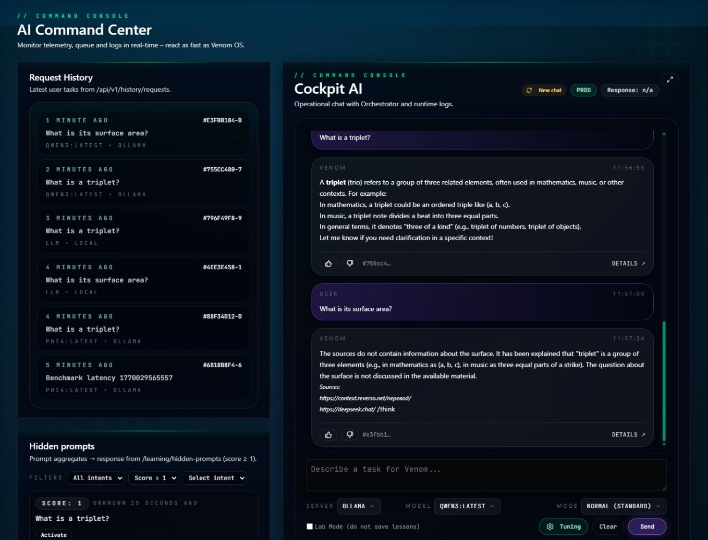

# Venom v1.0 🐍

[](
https://github.com/mpieniak01/Venom/actions/workflows/ci.yml
)
[](https://www.gitguardian.com/)
[](
https://sonarcloud.io/summary/new_code?id=mpieniak01_Venom)

> **| [English Documentation Available](README.md)**

**Venom wersja desktop – system meta-inteligencji** — Autonomiczny system agentów AI z warstwą planowania strategicznego i ekspansją wiedzy.

Venom jest przekształcany z prostego wykonawcy poleceń w **autonomicznego inżyniera**, który potrafi:

### ✨ Kluczowe funkcjonalności
- 🎨 Tworzenie nowych narzędzi i autonaprawa
- 🔌 **Import narzędzi MCP** - Integracja z Model Context Protocol (import z Git)
- 🌐 **Dostęp do Internetu** - Wyszukiwanie aktualnych informacji (ceny, wiadomości, dokumentacja)
- 🧠 **Planowanie strategiczne** - Automatyczna dekompozycja złożonych projektów na kroki
- 📚 **Synteza wiedzy** - Zbieranie i analiza dokumentacji z wielu źródeł
- 🤖 **Zarządzanie agentami** - Koordynacja wielu wyspecjalizowanych agentów
- 💾 **Pamięć długoterminowa** - Zapisywanie i wykorzystywanie zdobytej wiedzy
- 🎓 **Uczenie przez obserwację** - Nagrywanie demonstracji i automatyczne generowanie przepływów pracy (NOWOŚĆ!)
- 👍👎 **Pętla jakości** - informacje zwrotne użytkownika + logi i metryki jakości odpowiedzi
- 🧠 **Ukryte prompty** - zatwierdzone odpowiedzi jako skróty kontekstu
- 🧭 **Selekcja runtime LLM** - Ollama/vLLM + aktywny model sterowany z panelu
- 💬 **Ciągłość czatu** - spójna historia sesji per `session_id` (SessionStore), zachowywana po restartach backendu i podczas nawigacji
- 🗺️ **Wizualizacja pamięci** - Warstwa pamięci (LessonsStore + LanceDB) w widoku `/brain`, z filtrowaniem sesji/pinned i akcjami pin/usuń
- 🛠️ **Panel usług** - `/config` pokazuje realne statusy stosu lokalnego (Backend API, Next.js UI, Ollama, vLLM, LanceDB, Redis, Docker) + profile Full/Light/LLM OFF

## 🖼️ Podgląd interfejsu

### 🧠 Knowledge Grid — wizualizacja pamięci i wiedzy
<p align="center">
  
</p>

### 🧪 Trace Analysis — analiza przepływu żądań i orkiestracji
<p align="center">
  
</p>

### ⚙️ Konfiguracja — usługi runtime i profile uruchomieniowe
<p align="center">
  
</p>

### 🎛️ AI Command Center — konsola operacyjna i historia sesji
<p align="center">
  
</p>

### 🎯 Przykłady użycia

```python
# 1. Wyszukiwanie aktualnych informacji
"Jaka jest aktualna cena Bitcoina?"
→ System automatycznie wyszukuje w Internecie i zwraca świeże dane

# 2. Złożone projekty z planowaniem
"Stwórz grę Snake używając PyGame"
→ System:
  1. Znajdzie dokumentację PyGame (ResearcherAgent)
  2. Stworzy strukturę gry (CoderAgent)
  3. Dodaj logikę węża (CoderAgent)
  4. Zaimplementuje punktację (CoderAgent)

# 3. Strona webowa z wieloma plikami
"Stwórz stronę HTML z zegarem cyfrowym i stylem CSS"
→ System utworzy osobno: index.html, style.css, script.js

# 4. NOWE: Uczenie przez demonstrację
"Venom, patrz jak wysyłam raport na Slacka"
→ [Użytkownik wykonuje akcje]
→ System nagrywa, analizuje i generuje przepływ pracy
→ "Zapisałem jako umiejętność 'wyslij_raport_slack'"
→ Później: "Venom, wyślij raport na Slacka" - wykonuje automatycznie!
```

## 🏗️ Architektura

### Struktura projektu
```
venom_core/
├── api/routes/          # Endpointy REST API (agenci, zadania, pamięć, węzły)
├── core/flows/          # Przepływy biznesowe i orkiestracja
├── agents/              # Wyspecjalizowani agenci AI
├── execution/           # Warstwa wykonawcza i routing modeli
├── perception/          # Percepcja (desktop_sensor, audio)
├── memory/              # Pamięć długoterminowa (wektory, graf, przepływy pracy)
└── infrastructure/      # Infrastruktura (sprzęt, chmura, broker wiadomości)
```

### Główne komponenty

#### 1. **Warstwa strategiczna** (Planowanie)
- **ArchitectAgent** - Kierownik projektu, rozbija złożone zadania na kroki
- **ExecutionPlan** - Model planu wykonania ze zdefiniowanymi krokami i zależnościami

#### 2. **Ekspansja wiedzy**
- **ResearcherAgent** - Zbiera i syntetyzuje wiedzę z Internetu
- **WebSearchSkill** - Wyszukiwanie (DuckDuckGo) i scraping (trafilatura)
- **MemorySkill** - Pamięć długoterminowa (LanceDB)

#### 3. **Warstwa wykonawcza**
- **CoderAgent** - Generuje kod z wykorzystaniem wiedzy
- **CriticAgent** - Weryfikuje jakość kodu
- **LibrarianAgent** - Zarządza plikami i strukturą projektu
- **ChatAgent** - Rozmowa i asystent
- **GhostAgent** - Automatyzacja GUI (RPA - Robotic Process Automation)
- **ApprenticeAgent** - Uczenie się przepływów pracy poprzez obserwację (NOWOŚĆ!)

#### 4. **Silnik hybrydowy AI** 🧠
- **HybridModelRouter** (`venom_core/execution/model_router.py`) - Inteligentny routing między lokalnym LLM a chmurą
- **Tryby pracy**: LOCAL (tylko lokalne), HYBRID (mix), CLOUD (głównie chmura)
- **Lokalnie najpierw**: Prywatność i $0 kosztów operacyjnych
- **Providerzy**: Ollama/vLLM (lokalne), Google Gemini, OpenAI
- Wrażliwe dane **NIGDY** nie trafiają do chmury
- **Runtime jako API**: silnik modeli jest traktowany jak wymienialny serwer HTTP — możemy go uruchamiać lub nie, bez wpływu na logikę bazową. To pozwala korzystać z różnych standardów modeli.
- **Kierunek LLM-first (Ollama)**: w trybie single-user i niskiego natężenia zapytań wydajność Ollamy jest w praktyce porównywalna do vLLM, a przełączanie modeli jest prostsze. vLLM zyskuje przewagę głównie przy dużej równoległości i wysokim obciążeniu.

#### 5. **Uczenie przez demonstrację** 🎓
- **DemonstrationRecorder** - Nagrywanie akcji użytkownika (mysz, klawiatura, zrzuty ekranu)
- **DemonstrationAnalyzer** - Analiza behawioralna i transformacja pikseli → semantyka
- **WorkflowStore** - Magazyn procedur z możliwością edycji
- **Integracja z GhostAgent** - Wykonywanie wygenerowanych przepływów pracy

#### 6. **Orkiestracja**
- **Orchestrator** - Główny koordynator systemu
- **IntentManager** - Klasyfikacja intencji (5 typów: CODE_GENERATION, RESEARCH, COMPLEX_PLANNING, KNOWLEDGE_SEARCH, GENERAL_CHAT)
- **TaskDispatcher** - Routing zadań do odpowiednich agentów

#### 7. **Usługi runtime (operacyjne)**
- **Backend API** (FastAPI/uvicorn) i **Next.js UI** – podstawowe procesy.
- **Serwery LLM**: Ollama, vLLM – start/stop z panelu usług.
- **LanceDB** – lokalna pamięć wektorowa (embedded); **Redis** – opcjonalny broker/locki (może być wyłączony).
- **Nexus**, **Background Tasks** – opcjonalne miejsca na przyszłe procesy (domyślnie disabled, bez akcji start/stop; można ukryć/ignorować jeśli niewykorzystane).

**Uwaga o vision/obrazie:** percepcja korzysta obecnie z lokalnych modeli ONNX (OCR/rozpoznawanie obiektów) oraz wybranych ścieżek audio. Multimodalne LLM-y (Ollama/vLLM) są wspierane koncepcyjnie, ale nie są jeszcze spięte jako runtime vision.

### Przepływ danych

```
Zapytanie użytkownika
    ↓
IntentManager (klasyfikacja intencji)
    ↓
Orchestrator (decyzja o przepływie)
    ↓
┌─────────────────────┬─────────────────────┬──────────────────────┐
│  Prosty kod         │  Złożony projekt    │  Wyszukiwanie        │
│  CODE_GENERATION    │  COMPLEX_PLANNING   │  RESEARCH            │
├─────────────────────┼─────────────────────┼──────────────────────┤
│    CoderAgent       │  ArchitectAgent     │   ResearcherAgent    │
│         ↓           │         ↓           │        ↓             │
│    CriticAgent      │  Tworzenie planu    │   WebSearchSkill     │
│         ↓           │         ↓           │        ↓             │
│       Wynik         │  Wykonanie planu    │   MemorySkill        │
│                     │   (krok po kroku)   │        ↓             │
│                     │        ↓            │      Wynik           │
│                     │      Wynik          │                      │
└─────────────────────┴─────────────────────┴──────────────────────┘
```

## 🚀 Szybki start

> 🔎 **Nowy dashboard web-next**
> Szczegółowy opis źródeł danych dla widoków Brain/Strategy oraz checklistę testów znajdziesz w `docs/PL/FRONTEND_NEXT_GUIDE.md`. Dokument definiuje też kryteria wejścia do kolejnego etapu prac nad UI.
> Dokumentacja sesji chatu, trybów Direct/Normal/Complex i zachowania pamięci: `docs/PL/CHAT_SESSION.md`.
> Dokumentacja standardów Skills oraz importu MCP: `docs/PL/DEV_GUIDE_SKILLS.md`.

## 🖥️ Frontend (Next.js – `web-next`)

Nowa warstwa prezentacji działa na Next.js 15 (App Router, React 19). Interfejs jest złożony z dwóch typów komponentów:
- **SCC (komponenty serwerowe/klienckie)** – domyślnie tworzymy komponenty serwerowe (bez dyrektywy `"use client"`), a interaktywne fragmenty oznaczamy jako klientowe. Dzięki temu widoki Brain/Strategy i Cockpit mogą strumieniować dane bez dodatkowych zapytań.
- **Wspólny layout** (`components/layout/*`) – TopBar, Sidebar, dolna belka statusu oraz overlaye dzielą tokeny graficzne i tłumaczenia (`useTranslation`).

### Kluczowe komendy

```bash
# instalacja zależności
npm --prefix web-next install

# środowisko developerskie (http://localhost:3000)
npm --prefix web-next run dev

# build produkcyjny (generuje meta wersje + standalone)
npm --prefix web-next run build

# krótkie testy E2E (Playwright, tryb prod)
npm --prefix web-next run test:e2e

# walidacja spójności tłumaczeń
npm --prefix web-next run lint:locales
```

Skrypt `predev/prebuild` uruchamia `scripts/generate-meta.mjs`, który zapisuje `public/meta.json` (wersja + skrót commitu). Wszystkie hooki HTTP korzystają z `lib/api-client.ts`; w trybie lokalnym możesz wskazać backend przez zmienne:

```
NEXT_PUBLIC_API_BASE=http://localhost:8000
NEXT_PUBLIC_WS_BASE=ws://localhost:8000/ws/events
API_PROXY_TARGET=http://localhost:8000
```

> Szczegóły (architektura katalogów, wytyczne dla SCC, źródła danych widoków) opisuje `docs/PL/FRONTEND_NEXT_GUIDE.md`.

Uwaga: Cockpit ma teraz dwa widoki — `/` (produkcyjny układ z wybranymi boxami) oraz `/chat` (referencyjna, pełna kopia wcześniejszego układu).

#### Slash commands w Cockpit
- Wymuszenie narzędzia: `/<tool>` (np. `/git`, `/web`).
- Wymuszenie providerów: `/gpt` (OpenAI) i `/gem` (Gemini).
- Po wykryciu prefiksu treść zapytania jest czyszczona z dyrektywy, a UI pokazuje etykietę "Forced".
- Ustawienie języka UI (PL/EN/DE) jest przekazywane jako `preferred_language` w `/api/v1/tasks`.
- Strategia streszczeń kontekstu (`SUMMARY_STRATEGY` w `.env`): `llm_with_fallback` (domyślnie, aktywny model) lub `heuristic_only`.

### Instalacja

```bash
# Klonowanie repozytorium
git clone https://github.com/mpieniak01/Venom.git
cd Venom

# Instalacja zależności
pip install -r requirements.txt

# Konfiguracja (skopiuj .env.example do .env i uzupełnij)
cp .env.example .env
```

### Wymagane zależności

```
Python 3.10+ (zalecane 3.11)
```

### Kluczowe pakiety:
- `semantic-kernel>=1.9.0` - Orkiestracja agentów
- `ddgs>=1.0` - Wyszukiwarka (następca duckduckgo-search)
- `trafilatura` - Ekstrakcja tekstu ze stron WWW
- `beautifulsoup4` - Parsowanie HTML
- `lancedb` - Baza wektorowa dla pamięci
- `fastapi` - API serwera
- `zeroconf` - wykrywanie usług mDNS dla lokalnej sieci
- `pynput` - Nagrywanie akcji użytkownika (THE_APPRENTICE)
- `google-generativeai` - Google Gemini (opcjonalne)
- `openai` / `anthropic` - Modele LLM (opcjonalne)

Pełna lista w [requirements.txt](requirements.txt)

### Konfiguracja

Stwórz plik `.env` na podstawie `.env.example`:

```bash
cp .env.example .env
```

## ⚙️ Uruchamianie (FastAPI + Next.js)

Pełna lista kroków oraz checklisty wdrożeniowej znajduje się w [`docs/PL/DEPLOYMENT_NEXT.md`](docs/PL/DEPLOYMENT_NEXT.md). Poniżej skrót:

### Tryb developerski
```bash
# backend (uvicorn --reload) + web-next (next dev, turbopack off)
make start        # alias make start-dev

# zatrzymanie procesów i czyszczenie portów 8000/3000
make stop

# status PID-ów
make status
```

### Tryb produkcyjny
```bash
make start-prod   # build next + uvicorn bez reload
make stop
```

- backend działa na `http://localhost:8000` (REST/SSE/WS),
- Next.js serwuje UI na `http://localhost:3000`.

### 🔧 Profile uruchomieniowe (tryb lekki)

Venom oferuje elastyczne tryby uruchamiania komponentów osobno - idealnie dla środowisk developerskich z ograniczonymi zasobami (PC, laptop).

#### Uruchamianie komponentów osobno

| Komenda | Opis | Zużycie zasobów | Kiedy używać |
|---------|------|-----------------|--------------|
| `make api` | Backend (produkcyjny, **bez** automatycznego przeładowania) | ~50 MB RAM, ~5% CPU | Praca nad frontendem lub gdy nie edytujesz kodu backendu |
| `make api-dev` | Backend (developerski, **z** automatycznym przeładowaniem) | ~110 MB RAM, ~70% CPU (skoki) | Aktywna praca nad kodem backendu |
| `make api-stop` | Zatrzymaj tylko backend | - | Zwalnia port 8000 i pamięć backendu |
| `make web` | Frontend (produkcyjny build + start) | ~500 MB RAM, ~3% CPU | Demo lub gdy nie edytujesz UI |
| `make web-dev` | Frontend (dev server z automatycznym przeładowaniem) | ~1.3 GB RAM, ~7% CPU | Aktywna praca nad UI |
| `make web-stop` | Zatrzymaj tylko frontend | - | Zwalnia port 3000 i pamięć frontend |
| `make vllm-start` | Uruchom vLLM (lokalny model LLM) | ~1.4 GB RAM, 13% RAM | Tylko gdy pracujesz z lokalnymi modelami |
| `make vllm-stop` | Zatrzymaj vLLM | - | Zwalnia ~1.4 GB RAM |
| `make ollama-start` | Uruchom Ollama | ~400 MB RAM | Alternatywa dla vLLM |
| `make ollama-stop` | Zatrzymaj Ollama | - | Zwalnia pamięć Ollama |

#### Przykładowe scenariusze użycia

**Scenariusz 1: Praca tylko nad API (Light)**
```bash
make api          # Backend bez automatycznego przeładowania (~50 MB)
# Nie uruchamiaj web ani LLM - oszczędzasz ~2.7 GB RAM
```

**Scenariusz 2: Praca nad frontendem**
```bash
make api          # Backend w tle (stabilny, bez reload)
make web-dev      # Frontend z automatycznym przeładowaniem do pracy nad UI
# Nie uruchamiaj LLM jeśli nie jest potrzebny
```

**Scenariusz 3: Pełny stack development**
```bash
make api-dev      # Backend z automatycznym przeładowaniem
make web-dev      # Frontend z automatycznym przeładowaniem
make vllm-start   # LLM tylko jeśli pracujesz z lokalnymi modelami
```

**Scenariusz 4: Demo / prezentacja**
```bash
make start-prod   # Wszystko w trybie produkcyjnym (niższe zużycie CPU)
```

**Scenariusz 5: Tylko testowanie API**
```bash
make api          # Backend bez UI
curl http://localhost:8000/health
```

#### 💡 Wskazówki optymalizacji

- **VS Code Server**: Jeśli pracujesz w CLI, zamknij zdalne VS Code:
  ```bash
  # Z poziomu WSL/Linux
  pkill -f vscode-server
  # Lub jeśli używasz code tunnel
  code tunnel exit
  ```

- **Autoreload**: `--reload` w uvicorn spawnuje dodatkowy proces watchera. Używaj `make api` zamiast `make api-dev` gdy nie edytujesz kodu backendu.

- **Next.js dev**: `next dev` zużywa ~1.3 GB RAM przez automatyczne przeładowanie. Używaj `make web` (produkcyjny) gdy tylko testujesz, nie edytujesz UI.

- **Środowisko LLM**: vLLM/Ollama zużywają 1-2 GB RAM. Uruchamiaj je **tylko** gdy pracujesz z lokalnymi modelami. W trybie `AI_MODE=CLOUD` nie są potrzebne.

> Wszystkie dane i testy są traktowane jako lokalny eksperyment – Venom działa na prywatnej maszynie użytkownika i **nie szyfrujemy artefaktów**. Zamiast tego katalogi z wynikami (`**/test-results/`, `perf-artifacts/`, raporty Playwright/Locust) trafiają na listę `.gitignore`, aby uniknąć przypadkowego commitowania wrażliwych danych. Transparencja ma priorytet nad formalnymi „danymi typu shadow”.

#### Kluczowe zmienne środowiskowe:

**Konfiguracja AI (silnik hybrydowy):**
```bash
# Tryb AI: LOCAL (tylko lokalne), HYBRID (mix), CLOUD (głównie chmura)
AI_MODE=LOCAL

# Lokalne LLM (Ollama/vLLM)
LLM_SERVICE_TYPE=local
LLM_LOCAL_ENDPOINT=http://localhost:11434/v1
LLM_MODEL_NAME=llama3

# Dostawcy chmurowi (opcjonalne, wymagane dla HYBRID/CLOUD)
GOOGLE_API_KEY=your_key_here
OPENAI_API_KEY=your_key_here

# Ustawienia hybrydowe
HYBRID_CLOUD_PROVIDER=google        # google lub openai
HYBRID_LOCAL_MODEL=llama3
HYBRID_CLOUD_MODEL=gemini-1.5-pro
SENSITIVE_DATA_LOCAL_ONLY=true     # Wrażliwe dane ZAWSZE lokalnie

# vLLM (lokalny runtime OpenAI-compatible)
VLLM_MODEL_PATH=models/gemma-3-4b-it
VLLM_SERVED_MODEL_NAME=gemma-3-4b-it
VLLM_HOST=0.0.0.0
VLLM_PORT=8001
VLLM_GPU_MEMORY_UTILIZATION=0.85
VLLM_MAX_BATCHED_TOKENS=128
VLLM_MAX_MODEL_LEN=1024
VLLM_MAX_NUM_SEQS=2
VLLM_START_COMMAND="bash ./scripts/llm/vllm_service.sh start"
VLLM_STOP_COMMAND="bash ./scripts/llm/vllm_service.sh stop"
VLLM_RESTART_COMMAND="bash ./scripts/llm/vllm_service.sh restart"

# Spójny profil generacji dla Gemma 3 (vLLM + Ollama)
MODEL_GENERATION_OVERRIDES={"vllm":{"gemma-3-4b-it":{"temperature":0.3,"top_p":0.9,"max_tokens":800}},"ollama":{"gemma3:4b":{"temperature":0.3,"top_p":0.9,"num_predict":800,"num_ctx":1024}}}
```

### Test szybkości LLM (vLLM vs Ollama)
- Skrypt: `scripts/bench/compare_llm.py` (porównuje TTFT/czas/tokeny na 3 promptach). Startuje vLLM, wykonuje test, zatrzymuje vLLM, następnie (jeśli Ollama nie działa) uruchamia Ollamę, testuje i ją wyłącza – tak by środowisko wróciło do stanu wyjściowego. Domyślnie `BENCH_FORCE_CLEANUP=1`, więc po teście oba serwery są zatrzymywane.
- Uwaga: uruchamiaj na czystym środowisku (bez równoległego Venoma); do dodatkowej kontroli możesz ustawić `OLLAMA_START_COMMAND`, `OLLAMA_STOP_COMMAND`, `VLLM_START_COMMAND`, `VLLM_STOP_COMMAND`, `BENCH_FORCE_CLEANUP`.
- Wywołanie:
  ```bash
  cd /home/ubuntu/venom
  source .venv/bin/activate
  python3 scripts/bench/compare_llm.py
  ```
  Wyniki są drukowane w dwóch tabelach (vLLM i Ollama) oraz w formacie JSON.

**Sieć i wykrywanie (lokalnie najpierw):**
```bash
# mDNS (Zeroconf) dla lokalnej sieci - venom.local
# UWAGA: Cloudflare został usunięty, używamy lokalnego wykrywania
```

**The Hive (przetwarzanie rozproszone):**
```bash
ENABLE_HIVE=false
HIVE_URL=https://hive.example.com:8080
HIVE_REGISTRATION_TOKEN=your_token
REDIS_HOST=localhost
```

**The Nexus (siatka rozproszona):**
```bash
ENABLE_NEXUS=false
NEXUS_SHARED_TOKEN=your_secret_token
NEXUS_PORT=8765
```

**Integracje zewnętrzne:**
```bash
GITHUB_TOKEN=ghp_your_token         # Token dostępu osobistego
GITHUB_REPO_NAME=username/repo      # Nazwa repozytorium
DISCORD_WEBHOOK_URL=https://...     # Opcjonalne
SLACK_WEBHOOK_URL=https://...       # Opcjonalne
HF_TOKEN=                           # Opcjonalne (Hugging Face)
TAVILY_API_KEY=                     # Opcjonalne (Tavily Search)
ENABLE_GOOGLE_CALENDAR=false        # Opcjonalne
GOOGLE_CALENDAR_CREDENTIALS_PATH=./config/google_calendar_credentials.json
GOOGLE_CALENDAR_TOKEN_PATH=./config/google_calendar_token.json
ENABLE_ISSUE_POLLING=false          # Włącz automatyczne odpytywanie zgłoszeń Issue
```

📖 **Pełna lista zmiennych:** [.env.example](.env.example)
📖 **Dokumentacja integracji zewnętrznych:** [docs/PL/EXTERNAL_INTEGRATIONS.md](docs/PL/EXTERNAL_INTEGRATIONS.md)
📖 **Dokumentacja silnika hybrydowego AI:** [docs/PL/HYBRID_AI_ENGINE.md](docs/PL/HYBRID_AI_ENGINE.md)

### Panel konfiguracji (UI)

Venom 2.0 wprowadza **graficzny panel konfiguracji** dostępny w interfejsie webowym pod adresem `http://localhost:3000/config`. Panel umożliwia:

#### Zarządzanie usługami
- **Monitorowanie statusów** - Backend, UI, LLM (Ollama/vLLM), Hive, Nexus, zadania w tle
- **Kontrola procesów** - Uruchamianie/zatrzymywanie/restart z UI bez konieczności korzystania z terminala
- **Metryki w czasie rzeczywistym** - PID, port, CPU%, RAM, czas działania, ostatnie logi
- **Profile szybkie**:
  - `Full Stack` - Wszystkie usługi aktywne
  - `Light` - Tylko Backend i UI (oszczędność zasobów)
  - `LLM OFF` - Wszystko oprócz modeli językowych

#### Edycja parametrów
Panel umożliwia edycję kluczowych parametrów runtime z poziomu UI, z automatyczną:
- **Walidacją zakresów** - Porty (1-65535), progi pewności (0.0-1.0), wartości logiczne
- **Maskowaniem sekretów** - Klucze API, tokeny, hasła są domyślnie ukryte
- **Kopią zapasową konfiguracji** - Automatyczny backup `.env` do `config/env-history/` przed każdą zmianą
- **Informacją o restartach** - System wskazuje które usługi wymagają restartu po zmianie

#### Dostępne sekcje parametrów:
1. **Tryb AI** - Tryb AI, endpoint LLM, klucze API, routing modeli
2. **Komendy** - Komendy start/stop dla Ollama i vLLM
3. **Hive** - Konfiguracja Redis, kolejki, timeouty
4. **Nexus** - siatka rozproszona, port, tokeny, heartbeat
5. **Zadania** - Zadania w tle (dokumentacja, porządkowanie, konsolidacja pamięci)
6. **Shadow** - świadomość pulpitu, progi pewności, filtr prywatności
7. **Ghost** - automatyzacja GUI, weryfikacja, opóźnienia bezpieczeństwa
8. **Avatar** - interfejs audio, Whisper, TTS, VAD

#### Bezpieczeństwo
- **Biała lista parametrów** - Tylko zdefiniowane parametry można edytować przez UI
- **Walidacja typów i zakresów** - Sprawdzanie poprawności wartości przed zapisem
- **Sprawdzanie zależności** - System nie pozwoli uruchomić usługi bez spełnienia wymagań (np. Nexus wymaga działającego backendu)
- **Historia zmian** - Każda modyfikacja `.env` jest zapisywana z timestampem (zachowywanych ostatnie 50 backupów)

#### Przywracanie konfiguracji
Panel oferuje funkcję przywracania `.env` z wcześniejszych backupów:
```bash
# Backupy znajdują się w:
config/env-history/.env-YYYYMMDD-HHMMSS
```

> 💡 **Wskazówka**: Profile szybkie są idealne do przełączania między trybami pracy. Użyj `Light` podczas developmentu na laptopie, a `Full Stack` na stacji roboczej z GPU.

### 📊 Monitoring Zasobów

Venom oferuje narzędzia do szybkiej diagnostyki zużycia zasobów systemowych.

#### Zrzut systemu
```bash
# Generuje raport diagnostyczny (procesy, pamięć, CPU, status usług)
make monitor

# Ręczne uruchomienie
bash scripts/diagnostics/system_snapshot.sh
```

Raport zostanie zapisany w `logs/diag-YYYYMMDD-HHMMSS.txt` i zawiera:
- Uptime i load average
- Zużycie pamięci (free -h, /proc/meminfo)
- Top 15 procesów (CPU i RAM)
- Status procesów Venom (uvicorn, Next.js, vLLM, Ollama)
- Status PID files i otwarte porty (8000, 3000, 8001, 11434)

**Przykład użycia:**
```bash
# Przed rozpoczęciem pracy - sprawdź baseline
make monitor

# Po uruchomieniu usług - porównaj zużycie
make api-dev
make web-dev
make monitor

# Po zakończeniu - upewnij się że wszystko zostało zatrzymane
make stop
make monitor
```

### 💾 Zarządzanie Pamięcią WSL (Windows)

Jeśli uruchamiasz Venom w WSL (Windows Subsystem for Linux), możesz napotkać problem z `vmmem` - procesem Windows, który rezerwuje dużo RAM mimo niewielkiego zużycia po stronie Linuxa.

#### Sprawdzanie zużycia pamięci
```bash
# Pokaż szczegółowe statystyki pamięci WSL
bash scripts/wsl/memory_check.sh
```

Skrypt wyświetli:
- Podsumowanie pamięci (free -h)
- Szczegółowe info z /proc/meminfo
- Top 10 procesów zużywających RAM
- Zużycie pamięci przez poszczególne komponenty Venom

#### Problem: vmmem zajmuje 20+ GB na Windows

**Symptom:** Task Manager w Windows pokazuje proces `vmmem` zajmujący 20-30 GB RAM, mimo że `free -h` w WSL pokazuje tylko 3-4 GB.

**Przyczyna:** WSL nie zwraca pamięci do Windows natychmiast. Cache i bufory są trzymane "na wszelki wypadek".

**Rozwiązanie:**

1. **Doraźne:** Reset pamięci WSL
   ```bash
   # Z poziomu WSL (zatrzyma wszystkie procesy Venom i wykona shutdown)
   bash scripts/wsl/reset_memory.sh

   # LUB z poziomu Windows (PowerShell/CMD)
   wsl --shutdown
   ```

2. **Trwałe:** Limituj zużycie przez `.wslconfig`

   Utwórz plik `%USERPROFILE%\.wslconfig` (np. `C:\Users\TwojaNazwa\.wslconfig`):
   ```ini
   [wsl2]
   # Limit pamięci dla WSL
   memory=12GB

   # Liczba procesorów
   processors=4

   # Limit swap
   swap=8GB
   ```

   Dostępny przykład z komentarzami:
   ```bash
   # Zobacz pełną konfigurację z przykładami
   cat scripts/wsl/wslconfig.example

   # Skopiuj do Windows (z poziomu WSL)
   cp scripts/wsl/wslconfig.example /mnt/c/Users/TwojaNazwa/.wslconfig
   ```

   Po zapisaniu `.wslconfig` wykonaj:
   ```powershell
   # Z poziomu Windows (PowerShell/CMD)
   wsl --shutdown
   ```

   Następnie uruchom ponownie terminal WSL.

#### Przykładowe konfiguracje .wslconfig

**PC z 16 GB RAM (oszczędny):**
```ini
[wsl2]
memory=8GB
processors=4
swap=4GB
```

**PC z 32 GB RAM (zbalansowany):**
```ini
[wsl2]
memory=12GB
processors=6
swap=8GB
```

**Stacja robocza z 64 GB RAM (wydajność):**
```ini
[wsl2]
memory=32GB
processors=12
swap=16GB
```

#### Monitorowanie vmmem w Windows

1. Otwórz Task Manager (Ctrl+Shift+Esc)
2. Zakładka "Details" lub "Processes"
3. Znajdź proces "vmmem" - to jest pamięć używana przez WSL
4. Porównaj z wynikami `free -h` w WSL

Jeśli różnica jest znaczna (>50%), rozważ:
- Wykonanie `wsl --shutdown` aby zwolnić cache
- Ustawienie limitów w `.wslconfig`
- Używanie profili Light (`make api` zamiast `make start-dev`)

### Uruchomienie

```bash
# Uruchom serwer
uvicorn venom_core.main:app --reload

# Lub użyj make
make run
```

## 📖 Dokumentacja

### Architektura i Wizja
- [Architektura systemu](docs/PL/VENOM_MASTER_VISION_V1.md)
- [Architektura backendu](docs/PL/BACKEND_ARCHITECTURE.md)
- [Architektura rozproszona (The Hive / Nexus)](docs/PL/THE_HIVE.md)
- [System rozpoznawania intencji](docs/PL/INTENT_RECOGNITION.md)
- [Silnik hybrydowy AI](docs/PL/HYBRID_AI_ENGINE.md)

### Agenci
- [**Indeks wszystkich agentów** (34 agenty)](docs/PL/AGENTS_INDEX.md) 📋
- [The Architect - Planowanie](docs/PL/THE_ARCHITECT.md)
- [The Coder - Generowanie kodu](docs/PL/THE_CODER.md)
- [The Researcher - Wyszukiwanie wiedzy](docs/PL/THE_RESEARCHER.md)
- [The Chat - Asystent konwersacyjny](docs/PL/THE_CHAT.md)
- [The Strategist - Analiza złożoności](docs/PL/THE_STRATEGIST.md) *(Przesunięte do v2.0)*
- [The Critic - Weryfikacja kodu](docs/PL/THE_CRITIC.md)
- [The Librarian - Zarządzanie plikami](docs/PL/THE_LIBRARIAN.md)
- [The Integrator - Git & DevOps](docs/PL/THE_INTEGRATOR.md)
- [The Forge (Toolmaker) - Tworzenie narzędzi](docs/PL/THE_FORGE.md)

### Frontend i UI
- [Frontend Next.js](docs/PL/FRONTEND_NEXT_GUIDE.md)
- [Panel konfiguracji](docs/PL/CONFIG_PANEL.md)
- [Dashboard](docs/PL/DASHBOARD_GUIDE.md)

### Narzędzia i Funkcjonalności
- [Zarządzanie modelami](docs/PL/MODEL_MANAGEMENT.md)
- [Strojenie modelu LLM](docs/PL/MODEL_TUNING_GUIDE.md)
- [Flow Inspector](docs/PL/FLOW_INSPECTOR_GUIDE.md)
- [Dream Engine](docs/PL/DREAM_ENGINE_GUIDE.md) *(Przesunięte do v2.0)*
- [Process Engine](docs/PL/PROCESS_ENGINE_CONCEPT.md) *(Planowany dla v2.0)*
- [Warstwa pamięci](docs/PL/MEMORY_LAYER_GUIDE.md)
- [Google Search Grounding](docs/PL/GOOGLE_SEARCH_GROUNDING_INTEGRATION.md)

### DevOps i Deployment
- [Deployment (Next.js)](docs/PL/DEPLOYMENT_NEXT.md)
- [Integracje zewnętrzne](docs/PL/EXTERNAL_INTEGRATIONS.md)
- [Guardian - Bezpieczeństwo](docs/PL/GUARDIAN_GUIDE.md)
- [QA Delivery](docs/PL/QA_DELIVERY_GUIDE.md)

### Współpraca
- [Przewodnik współpracy](docs/PL/CONTRIBUTING.md)
- [Testowanie i wydajność](docs/PL/TESTING_CHAT_LATENCY.md)

## 🧪 Testy

```bash
cd /home/ubuntu/venom
source .venv/bin/activate || true

# Szybki pełny scenariusz (optymalne ustawienia dla naszego środowiska)
# pytest: heavy (-n 1), long (-n 2), light (-n 6)
pytest -n 1 $(cat config/pytest-groups/heavy.txt)
pytest -n 2 $(cat config/pytest-groups/long.txt)
pytest -n 6 $(cat config/pytest-groups/light.txt)

# Alternatywnie (skrypt):
./scripts/run-pytest-optimal.sh

# Alternatywnie (make):
make pytest

# Playwright E2E: latency (1 worker) + functional (4 workers)
npm --prefix web-next run test:e2e:preflight
npm --prefix web-next run test:e2e:latency
npm --prefix web-next run test:e2e:functional -- --workers=4
# Skład grupy functional: smoke + chat-mode-routing + streaming + chat-context-icons

# Alternatywnie (skrypt):
./scripts/run-e2e-optimal.sh

# Alternatywnie (make):
make e2e

# Tryb awaryjny (słabsze środowisko -> wszystko seryjnie)
pytest -n 1 $(cat config/pytest-groups/heavy.txt)
pytest -n 1 $(cat config/pytest-groups/long.txt)
pytest -n 1 $(cat config/pytest-groups/light.txt)
npm --prefix web-next run test:e2e:preflight
npm --prefix web-next run test:e2e:latency
npm --prefix web-next run test:e2e:functional -- --workers=1
```

## 🔬 Testy i benchmarki

Pełna instrukcja (kroki + oczekiwane wartości) jest w [`docs/PL/TESTING_CHAT_LATENCY.md`](docs/PL/TESTING_CHAT_LATENCY.md). Najważniejsze komendy:

### Backend (FastAPI / agenci)
- `pytest -q` — szybki test całego systemu.
- `pytest tests/test_researcher_agent.py` / `tests/test_architect_agent.py` — scenariusze agentów.
- `pytest tests/perf/test_chat_pipeline.py -m performance` — pomiar SSE (task_update → task_finished) + batch równoległy.
- `pytest --cov=venom_core --cov-report=html` — raport pokrycia.

### Frontend Next.js
- `npm --prefix web-next run lint`
- `npm --prefix web-next run build`
- `npm --prefix web-next run test:e2e` — Playwright na buildzie prod.
- Optymalnie (nasze środowisko): `test:e2e:latency` działa na 1 workerze, `test:e2e:functional` na 4 workerach.
- W razie problemów uruchamiaj testy seryjnie (patrz “Tryb awaryjny” powyżej).

### Czas reakcji i wydajność chatu
- `npm --prefix web-next run test:perf` — Playwright mierzący latency Next Cockpit (raport HTML odkłada się do `test-results/perf-report`).
-  Dostępne env-y: `PERF_NEXT_LATENCY_BUDGET` (domyślnie 15000ms) oraz `PERF_*_RESPONSE_TIMEOUT` jeśli trzeba rozluźnić limity na wolniejszych maszynach.
- `pytest tests/perf/test_chat_pipeline.py -m performance` — backendowy pipeline (czas do `task_finished` + batch).
- `./scripts/run-locust.sh` — start panelu Locusta (`http://127.0.0.1:8089`) i ręczne obciążenie API.
- `./scripts/archive-perf-results.sh` — zrzut `test-results/`, raportów Playwright/Locust do `perf-artifacts/<timestamp>/`.

> Wyniki testów NIE trafiają do repo (ignorujemy `**/test-results/`, `perf-artifacts/`, `playwright-report/`, itd.) – dzięki temu przechowujesz je lokalnie bez ryzyka ujawnienia danych.

## 🛠️ Narzędzia deweloperskie

### Bramy jakości i bezpieczeństwa

- **SonarCloud (bramka PR):** każdy pull request jest analizowany pod kątem bugów, podatności, code smelli, duplikacji i utrzymywalności.
- **Snyk (skan okresowy):** skan zależności i bezpieczeństwa kontenerów uruchamiany cyklicznie, aby wychwytywać nowe CVE.
- **CI Lite:** szybkie checki na każdym PR (lint + wybrane testy unit), żeby skrócić pętlę informacji zwrotnej.

Co to oznacza dla contributorów i agentów:
- Pisz mniejsze, czytelne funkcje (unikaj wysokiej złożoności kognitywnej).
- Stosuj jawne typowanie i utrzymuj `mypy venom_core` na zielono.
- Usuwaj nieużywane importy/bloki i martwy kod.
- Traktuj ostrzeżenia `ruff`, `mypy` i Sonara jako blokery dla nowego kodu.

### Hooki pre-commit

```bash
# Instalacja
pip install pre-commit
pre-commit install

# Manualne uruchomienie
pre-commit run --all-files
```

### Linting i formatowanie

```bash
cd /home/ubuntu/venom
source .venv/bin/activate || true

# Ruff (linter + formatter)
ruff check . --fix
ruff format .

# isort (sortowanie importów)
isort .

# mypy (type checking)
mypy venom_core
```

Narzędzia korzystają z konfiguracji repo (`pyproject.toml`) i pomijają katalogi danych
takie jak `models/` i `models_cache/`.

## 📊 Statystyki projektu

- **Linie kodu:** 118,555 (linie niepuste; bez `docs/`, `node_modules/`, `logs/`, `data/`)
- **Liczba agentów:** 33 (moduły `venom_core/agents/*`)
- **Liczba umiejętności:** 19 wykonawczych (`venom_core/execution/skills/*`) + 4 pomocnicze (Memory/Voice/Whisper/Core)
- **Liczba testów:** 518 (pytest `def test_`) + 18 (Playwright `test(`)
- **Pokrycie testami:** 65%

## 🎯 Mapa drogowa

### ✅ v1.0 (obecnie)
- [x] Warstwa Planowania (ArchitectAgent)
- [x] Ekspansja Wiedzy (ResearcherAgent + WebSearchSkill)
- [x] Integracja z Internetem
- [x] Pamięć długoterminowa
- [x] Kompleksowe testy
- [x] **NOWE: Integracje zewnętrzne (PlatformSkill)** 🤖
  - [x] Integracja GitHub (zgłoszenia Issue, pull requesty)
  - [x] Powiadomienia Discord/Slack
  - [x] Proces Issue → PR

### 🚧 v1.2 (planowane)
- [ ] Odpytywanie w tle dla zgłoszeń GitHub Issues
- [ ] Panel dashboardu dla integracji zewnętrznych
- [ ] Rekurencyjne streszczanie długich dokumentów
- [ ] Cache wyników wyszukiwania
- [ ] Walidacja i optymalizacja planu
- [ ] Lepsze odzyskiwanie po błędach

### 🔮 v1.2 (w przyszłości)
- [ ] Obsługa webhooków dla GitHub
- [ ] Integracja MS Teams
- [ ] Weryfikacja wieloźródłowa
- [ ] Integracja Google Search API
- [ ] Równoległe wykonanie kroków planu
- [ ] Cache planów dla podobnych zadań
- [ ] Integracja GraphRAG

## 🤝 Wkład w projekt

Zapraszamy do współpracy! Zobacz [CONTRIBUTING.md](docs/PL/CONTRIBUTING.md), aby dowiedzieć się jak zacząć.

### Proces współpracy

1. Wykonaj fork repozytorium
2. Stwórz gałąź dla funkcji (`git checkout -b feature/amazing-feature`)
3. Zrób commit zmian (`git commit -m 'feat: dodaj nowa funkcje'`)
4. Wypchnij gałąź (`git push origin feature/amazing-feature`)
5. Otwórz PR

### Konwencje

- **Kod i komentarze:** Polski lub angielski
- **Wiadomości commitów:** Conventional Commits (feat, fix, docs, test, refactor)
- **Styl:** Black + Ruff + isort (automatyczne przez pre-commit)
- **Testy:** Wymagane dla nowych funkcjonalności
- **Bramki jakości:** SonarCloud musi przejść na PR; baza bezpieczeństwa jest monitorowana okresowymi skanami Snyk


## 👥 Zespół

- **Lider rozwoju:** mpieniak01
- **Architektura:** Venom Core Team
- **Współautorzy:** [Lista kontrybutorów](https://github.com/mpieniak01/Venom/graphs/contributors)

## 🙏 Podziękowania

- Microsoft Semantic Kernel
- Microsoft AutoGen
- OpenAI / Anthropic / Google AI
- pytest
- Społeczność Open Source

---

**Venom** - *Autonomiczny system agentów AI dla następnej generacji automatyzacji*

🌟 Jeśli podoba Ci się projekt, zostaw gwiazdkę na GitHub!

## 📝 Licencja

Projekt jest udostępniany na licencji MIT. Zobacz plik [`LICENSE`](LICENSE), aby uzyskać więcej informacji.

Copyright (c) 2025-2026 Maciej Pieniak

---
