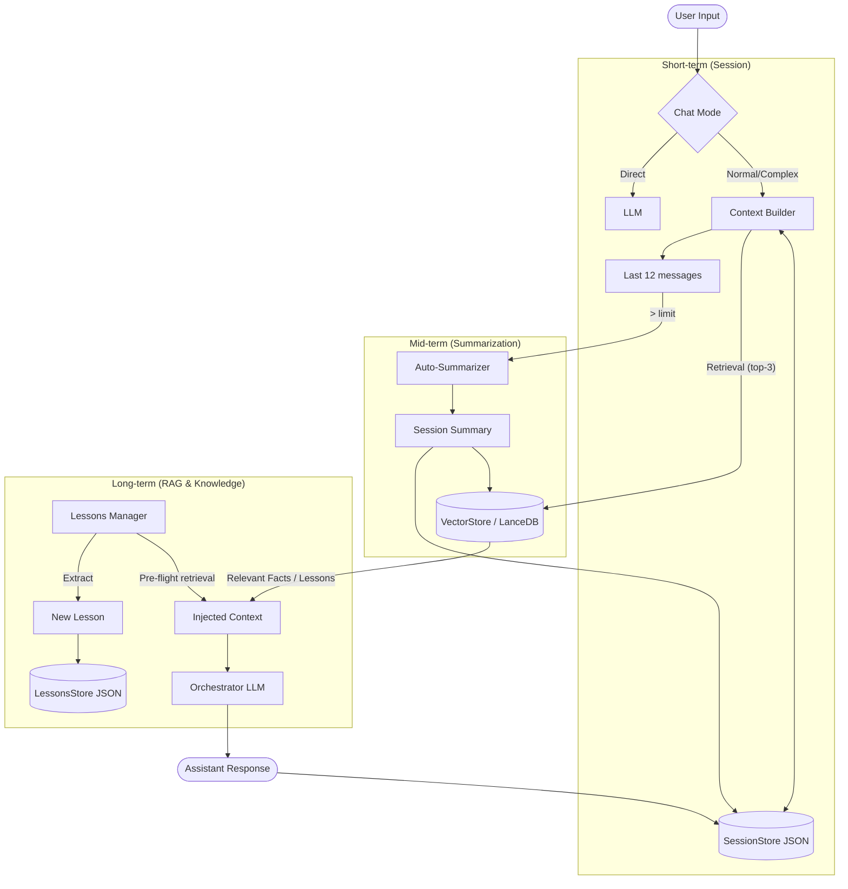

# Memory in Chat: End-to-End System

> **Status:** Draft / Specification
> **Related to:** PR_memory_analysis

This document describes the complete memory flow in Venom system: from volatile session memory, through summaries, to long-term vector and graph memory. It also contains specification of planned UI improvements (UI Specs).

---

## 1. Architecture and Flow

### Flow Diagram (Memory Flow)



### Memory Layers

System operates on 4 main persistence layers:

| Layer | Technical Name | Storage (File) | Retention (TTL) | Purpose |
| :--- | :--- | :--- | :--- | :--- |
| **1. Session History** | `context_history` | `session_store.json` | Until session end (or 12msg limit) | Current conversation fluency. |
| **2. Summary** | `session_summary` | `session_store.json` + LanceDB | Semi-permanent (until session deletion) | Maintaining thread in long conversations. |
| **3. Vector Memory** | `MemorySkill` | `data/memory/lancedb` | Permanent (Global/Session scoped) | Facts, preferences, pinned information. |
| **4. Lessons** | `LessonsStore` | `lessons.json` | Permanent (Global) | Meta-learning, avoiding error repetition. |

---

## 2. Unified Naming

To avoid confusion in code and UI:

- **Session History**: Raw conversation logs (User/Assistant).
- **Summary**: Compressed version of history generated automatically.
- **Memory Entry**: Single "fact" or text fragment in vector database (LanceDB).
- **Lesson**: Structured knowledge about system operation (e.g., "User prefers concise responses").
- **Knowledge Graph**: Network of relationships between code files (Code Graph) or concepts (Concept Graph).

---

## 3. UI Specification (New Features)

### A. Brain Screen: "Hygiene" Tab (Hygiene Management)

Missing element in current UI is advanced cleaning of lessons and old entries.

**Location:** `/brain` -> new Tab next to "Memory Graph" and "Repo".
**Name:** "Hygiene" (or "Cleanup").

**Features (Mockup):**

1.  **Section: Global Statistics**
    *   Lesson count: `124`
    *   Vector database size: `45 MB`
    *   Last backup (Chronos): `2h ago`

2.  **Section: Lesson Pruning (Batch removal)**
    *   *Action 1*: "Remove duplicates" (calls `POST /lessons/dedupe`).
    *   *Action 2*: "Remove older than..." (Input [ 30 ] days -> Button "Prune TTL").
    *   *Action 3*: "Remove tag" (Select [ tag ] -> Button "Delete Tag").
    *   *Action 4*: "Nuke All" (Button "Clear everything" with confirmation "type DELETE").

3.  **Table View**
    *   Columns: `ID`, `Date`, `Title`, `Tags`, `Actions (Trash)`.
    *   Multiselect for removing selected.

**Interface TypeScript (Draft):**

```typescript
interface PruningStats {
  deletedCount: number;
  remainingCount: number;
  message: string;
}

// API Hooks mapping
const pruneByTTL = async (days: number): Promise<PruningStats> => {
  return fetch(`/api/v1/memory/lessons/prune/ttl?days=${days}`, { method: 'DELETE' });
}
```

### B. Cockpit: Memory Context Feedback

User needs to know when Venom uses long-term memory in a given response.

**Location:** Assistant message bubble in Cockpit.
**Element:** Icon/Badge above message content (next to Timestamp).

**Display Logic:**
1.  In backend response (stream or final response) check `task.context_used` field.
2.  If `context_used.lessons.length > 0` -> Show icon 🎓 (Lesson).
    *   Tooltip: "Used X lessons: [Titles]".
3.  If `context_used.memory_entries.length > 0` -> Show icon 🧠 (Memory).
    *   Tooltip: "Retrieved from memory: [Fragments]".

---

## 4. Verification Plan (Test Scenarios)

### SCENARIO 1: Learning and Forgetting (Lessons Cycle)
1.  **Teach**: Write in chat "Remember, I always want responses in Polish".
2.  **Verify**: Check if lesson was created in `/brain` (Tag: `instructions` or `language`).
3.  **Test**: Ask in new session "Hello". Expected response in Polish.
4.  **Forget**: Go to `/brain` -> Hygiene -> Delete lesson (or use API prune).
5.  **Test**: Ask in new session "Hello". Expected response in English (or default).

### SCENARIO 2: Auto-Summary
1.  **Generate**: Conduct long conversation (>15 messages).
2.  **Verify**: Check in logs/SessionStore if `summary` was created.
3.  **Test**: Ask about detail from beginning of conversation. System should respond based on summary.

### SCENARIO 3: Pruning UI (When implemented)
1.  **Setup**: Generate 50 test lessons (with script).
2.  **Action**: In new Hygiene tab set "Remove older than 0 days" (or other criterion).
3.  **Verify**: Lesson counter drops to 0.

---

> Document is basis for implementing code changes (Phase 2).
