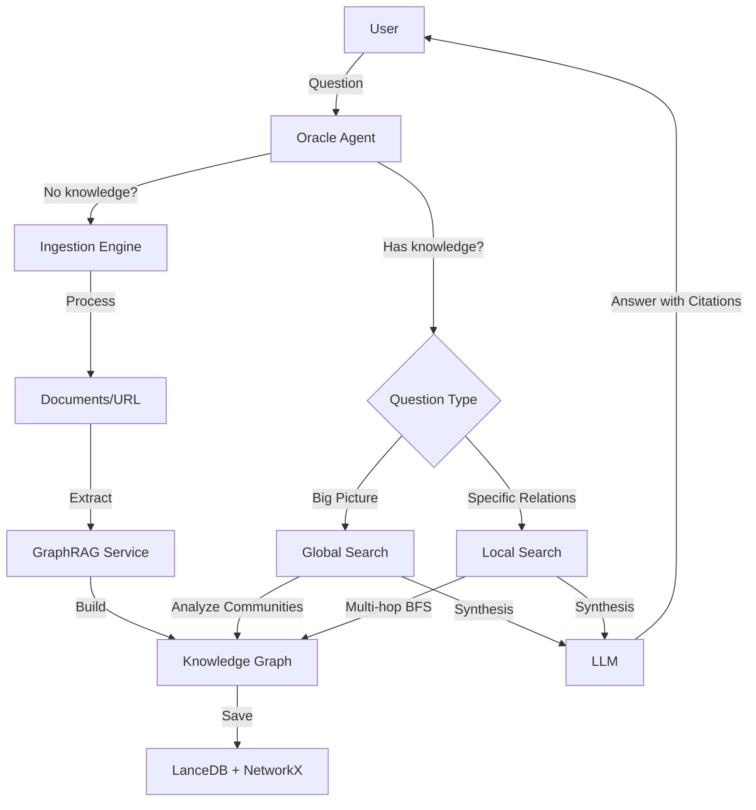

# Oracle Agent & GraphRAG - Documentation

## Overview

The Oracle Agent system is an advanced knowledge analysis engine using GraphRAG (Graph Retrieval-Augmented Generation) for multi-hop reasoning and deep document analysis.

## System Components

### 1. **Ingestion Engine** (`venom_core/memory/ingestion_engine.py`)

Engine for processing multi-format data.

**Supported Formats:**
- 📄 **PDF** - uses `markitdown` or `pypdf`
- 📝 **DOCX** - uses `markitdown` or `python-docx`
- 🖼️ **Images** (PNG, JPG, GIF, etc.) - uses Vision Engine (OpenAI/Ollama) for description
- 🎵 **Audio** (MP3, WAV, OGG) - uses Whisper for transcription
- 🎬 **Video** (MP4, AVI, MKV) - extracts audio and transcribes
- 📋 **Text** (TXT, MD, source code)
- 🌐 **URL** - downloads and cleans web content

**Key Functions:**
- `detect_file_type(path)` - detects file type
- `ingest_file(path)` - processes file
- `ingest_url(url)` - processes URL
- `_semantic_chunk(text)` - splits text semantically (not every N characters)

**Usage Example:**
```python
from venom_core.memory.ingestion_engine import IngestionEngine

engine = IngestionEngine()

# Process PDF
result = await engine.ingest_file("./documents/manual.pdf")
print(f"Chunks: {len(result['chunks'])}")
print(f"Type: {result['file_type']}")

# Process URL
result = await engine.ingest_url("https://example.com/article")
```

### 2. **GraphRAG Service** (`venom_core/memory/graph_rag_service.py`)

Advanced knowledge graph with entity and relationship extraction.

**Architecture:**
- **Nodes (Entities)**: Represent concepts, people, documents
- **Edges (Relationships)**: Relationships between entities (e.g., CREATED_BY, RELATED_TO)
- **Communities**: Clusters of related entities (Louvain algorithm)
- **VectorStore**: Hybrid search (semantic + keyword)

**Key Functions:**

```python
from venom_core.memory.graph_rag_service import GraphRAGService

graph = GraphRAGService()

# Add entity
graph.add_entity(
    entity_id="python",
    entity_type="ProgrammingLanguage",
    properties={"name": "Python", "created": "1991"}
)

# Add relationship
graph.add_relationship(
    source_id="python",
    target_id="guido_van_rossum",
    relationship_type="CREATED_BY"
)

# Extract knowledge from text (requires LLM)
await graph.extract_knowledge_from_text(
    text="Python was created by Guido van Rossum in 1991.",
    source_id="doc_1",
    llm_service=llm
)

# Global Search (questions about the big picture)
result = await graph.global_search(
    "What is this project about?",
    llm_service=llm
)

# Local Search (multi-hop reasoning)
result = await graph.local_search(
    "What is the relationship between X and Y?",
    max_hops=2,
    llm_service=llm
)
```

**Search Types:**

1. **Global Search**:
   - Analyzes communities in the graph
   - Creates cluster summaries
   - Good for questions like "What is this project about?"

2. **Local Search**:
   - Explores node neighborhoods (BFS)
   - Multi-hop reasoning (up to N steps)
   - Good for questions like "What is the relationship between X and Y?"

### 3. **Oracle Agent** (`venom_core/agents/oracle.py`)

Analytical agent using GraphRAG for deep analysis.

**Reasoning Loop:**
1. **Question Analysis** - understanding user intent
2. **Strategy Selection** - global vs local search
3. **Exploration** - gathering facts from the graph
4. **Synthesis** - combining facts into an answer
5. **Verification** - citing sources

**Available Functions (plugin):**
- `global_search(query)` - global search
- `local_search(query, max_hops)` - local search
- `ingest_file(path)` - process file
- `ingest_url(url)` - process URL
- `get_graph_stats()` - graph statistics

**Usage Example:**
```python
from semantic_kernel import Kernel
from venom_core.agents.oracle import OracleAgent

kernel = Kernel()
# ... kernel config ...

oracle = OracleAgent(kernel)

# Ask a difficult question
result = await oracle.process(
    "What is the relationship between agent Ghost and the Florence-2 module?"
)
print(result)
```

### 4. **Research Skill** (`venom_core/execution/skills/research_skill.py`)

Skill for data ingestion used by agents.

**Functions:**
- `digest_url(url)` - downloads and adds URL to graph
- `digest_file(path)` - processes file
- `digest_directory(path, recursive)` - processes directory
- `get_knowledge_stats()` - graph statistics

**Usage Example:**
```python
from venom_core.execution.skills.research_skill import ResearchSkill

skill = ResearchSkill()

# Add file
result = await skill.digest_file("./docs/manual.pdf")

# Add entire directory
result = await skill.digest_directory(
    "./docs/api",
    recursive=True
)

# Check statistics
stats = skill.get_knowledge_stats()
print(stats)
```

## Dependency Installation

```bash
# Basic dependencies (included in requirements-full.txt)
pip install networkx lancedb

# Document ingestion
pip install pypdf markitdown python-docx

# Web scraping
pip install trafilatura beautifulsoup4

# Vision (optional)
# Vision Engine is already in the project

# Audio (optional)
pip install faster-whisper
```

## Usage Examples

### Example 1: PDF Documentation Analysis

```python
import asyncio
from semantic_kernel import Kernel
from venom_core.agents.oracle import OracleAgent

async def analyze_pdf():
    kernel = Kernel()
    # ... config ...

    oracle = OracleAgent(kernel)

    # Process PDF
    await oracle.process(
        "Read file ./docs/washing_machine_manual.pdf and add to knowledge graph"
    )

    # Ask question
    result = await oracle.process(
        "Why is the red LED blinking on the washing machine?"
    )

    print(result)

asyncio.run(analyze_pdf())
```

### Example 2: Multi-Hop Reasoning

```python
# After processing project documentation...

result = await oracle.process(
    "What is the relationship between agent Ghost and the Florence-2 module? "
    "Explain the dependency chain step by step."
)

# Oracle might answer e.g.:
# "1. Agent Ghost uses Input Skill
#  2. Input Skill uses Vision Grounding
#  3. Vision Grounding is powered by Vision Engine
#  [Sources: ...]"
```

### Example 3: Persistent Knowledge Base

```python
# Build knowledge graph gradually...

# Day 1: Add documentation
await oracle.process("digest_file ./docs/api_spec.pdf")
await oracle.process("digest_url https://docs.python.org/3/")

# Day 2: Graph is saved automatically
# You can ask questions without re-ingestion
result = await oracle.process(
    "How to implement authorization according to API spec?"
)
```

## Typical Usage Workflow



## Performance & Optimization

### Semantic Chunking
- Instead of cutting text every 500 characters, we split logically:
  - By paragraphs (`\n\n`)
  - By sentences (`. `)
  - By clauses (`, `)

### Lazy Loading
- Vision Engine (OpenAI/Ollama) loaded only when needed
- Audio Engine (Whisper) loaded only when needed

### Cache
- Communities are cached
- Graph is saved after every operation

### LLM Costs
- Knowledge extraction: ~500-3000 tokens per document
- Global search: ~1000-2000 tokens per query
- Local search: ~500-1500 tokens per query
- **Optimization**: Use cheaper model (Phi-3, Mistral) for extraction, GPT-4o for synthesis

## Troubleshooting

### "No module named 'markitdown'"
```bash
pip install markitdown
# or
pip install pypdf  # fallback
```

### "Vision Engine unavailable"
- Local vision models require GPU or may be slow on CPU
- You can skip images or use only filename description

### "Audio Engine unavailable"
```bash
pip install faster-whisper
```

### Knowledge graph is empty
```python
# Check if files were processed
stats = graph.get_stats()
print(stats)

# Check if graph was loaded
graph.load_graph()
```

## Roadmap (Future Features)

- [ ] **Dashboard Knowledge Explorer** - graph visualization (vis.js/cytoscape.js)
- [ ] **Incremental Updates** - graph update without rebuild
- [ ] **Query Expansion** - automatic query expansion
- [ ] **Temporal Knowledge** - tracking changes over time
- [ ] **Multi-Graph** - multiple knowledge graphs (personal, project, public)
- [ ] **Export/Import** - export to Neo4j, RDF, etc.

## FAQ

**Q: Can I use Oracle without GPT-4?**
A: Yes! You can use local models (Ollama, vLLM, ONNX). Knowledge extraction and reasoning will work, though may be less precise.

**Q: How long does it take to process a 100-page PDF?**
A: ~30-60 seconds (depends on LLM speed and PDF quality).

**Q: Is the graph persistent?**
A: Yes, the graph is saved to `data/memory/knowledge_graph.json` and loaded automatically.

**Q: Can I use Oracle in API?**
A: Yes, Oracle is an agent and can be called via FastAPI endpoint.

**Q: Multi-hop reasoning - how many "hops" can I do?**
A: The `max_hops` parameter controls depth (default 2). More hops = more context, but longer queries.

## License

This module is part of the Venom project and is subject to the same license as the entire project.
