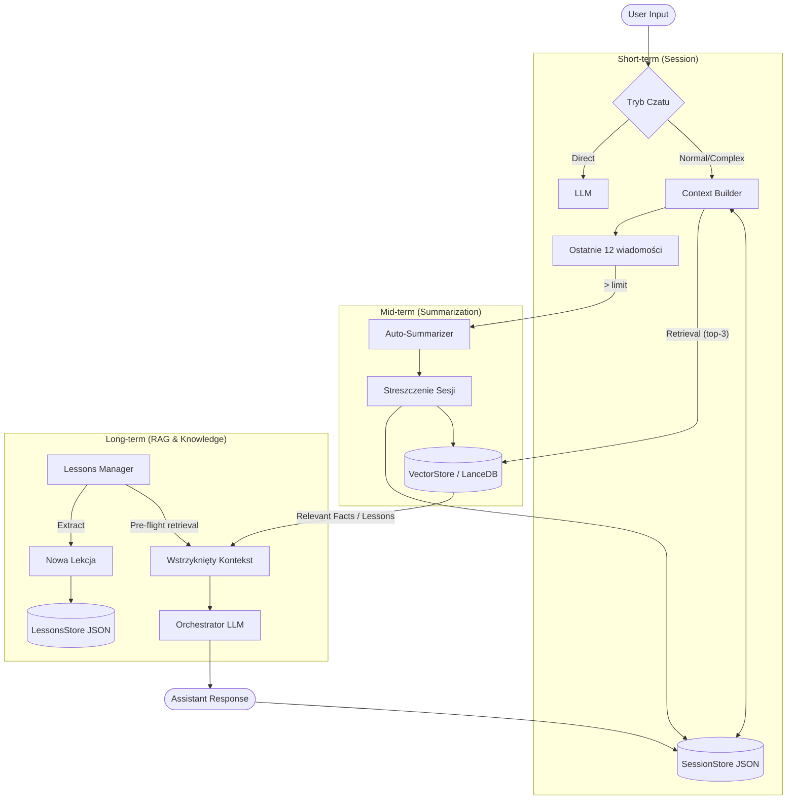

# Memory in Chat: End-to-End System

> **Status:** Draft / Specification
> **Related to:** PR_memory_analysis

Ten dokument opisuje kompletny przepływ pamięci w systemie Venom: od ulotnej pamięci sesji, przez streszczenia, aż po długoterminową pamięć wektorową i grafową. Zawiera również specyfikację planowanych usprawnień interfejsu (UI Specs).

---

## 1. Architektura i Przepływ

### Diagram Przepływu (Memory Flow)



### Warstwy Pamięci (Memory Layers)

System operuje na 4 głównych warstwach trwałości:

| Warstwa | Nazwa Techniczna | Magazyn (File) | Retencja (TTL) | Cel |
| :--- | :--- | :--- | :--- | :--- |
| **1. Session History** | `context_history` | `session_store.json` | Do końca sesji (lub limit 12msg) | Płynność bieżącej rozmowy. |
| **2. Summary** | `session_summary` | `session_store.json` + LanceDB | Pół-trwałe (do usunięcia sesji) | Utrzymanie wątku przy długich rozmowach. |
| **3. Vector Memory** | `MemorySkill` | `data/memory/lancedb` | Trwałe (Global/Session scoped) | Fakty, preferencje, przypięte informacje. |
| **4. Lessons** | `LessonsStore` | `lessons.json` | Trwałe (Global) | Meta-uczenie, unikanie powtarzania błędów. |

---

## 2. Ujednolicone Nazewnictwo

Aby uniknąć nieporozumień w kodzie i UI:

- **Session History (Historia Sesji)**: Surowe logi rozmowy (User/Assistant).
- **Summary (Streszczenie)**: Skompresowana wersja historii generowana automatycznie.
- **Memory Entry (Wpis Pamięci)**: Pojedynczy "fakt" lub fragment tekstu w bazie wektorowej (LanceDB).
- **Lesson (Lekcja)**: Ustrukturyzowana wiedza o działaniu systemu (np. "Użytkownik preferuje zwięzłe odpowiedzi").
- **Knowledge Graph**: Sieć powiązań między plikami kodu (Code Graph) lub pojęciami (Concept Graph).

---

## 3. Specyfikacja UI (Nowe Funkcjonalności)

### A. Brain Screen: Tab "Hygiene" (Zarządzanie Higieną)

Brakujący element w obecnym UI to zaawansowane czyszczenie lekcji i starych wpisów.

**Lokalizacja:** `/brain` -> nowy Tab obok "Memory Graph" i "Repo".
**Nazwa:** "Hygiene" (lub "Oczyszczanie").

**Funkcjonalności (Mockup):**

1.  **Sekcja: Global Statistics**
    *   Liczba lekcji: `124`
    *   Rozmiar bazy wektorowej: `45 MB`
    *   Ostatni backup (Chronos): `2h temu`

2.  **Sekcja: Lesson Pruning (Grupowe usuwanie)**
    *   *Akcja 1*: "Usuń duplikaty" (wywołuje `POST /lessons/dedupe`).
    *   *Akcja 2*: "Usuń starsze niż..." (Input [ 30 ] dni -> Button "Prune TTL").
    *   *Akcja 3*: "Usuń tag" (Select [ tag ] -> Button "Delete Tag").
    *   *Akcja 4*: "Nuke All" (Button "Wyczyść wszystko" z potwierdzeniem "wpisz DELETE").

3.  **Tabela Przeglądu (Table View)**
    *   Kolumny: `ID`, `Data`, `Tytuł`, `Tagi`, `Akcje (Kosz)`.
    *   Multiselect do usuwania wybranych.

**Interface TypeScript (Draft):**

```typescript
interface PruningStats {
  deletedCount: number;
  remainingCount: number;
  message: string;
}

// API Hooks mapping
const pruneByTTL = async (days: number): Promise<PruningStats> => {
  return fetch(`/api/v1/memory/lessons/prune/ttl?days=${days}`, { method: 'DELETE' });
}
```

### B. Cockpit: Memory Context Feedback

Użytkownik musi wiedzieć, kiedy Venom korzysta z pamięci długoterminowej w danej odpowiedzi.

**Lokalizacja:** Dymek wiadomości Asystenta w Cockpicie.
**Element:** Ikona/Badge nad treścią wiadomości (obok Timestamp).

**Logika Wyświetlania:**
1.  W odpowiedzi backendu (stream lub final response) sprawdzić pole `task.context_used`.
2.  Jeśli `context_used.lessons.length > 0` -> Pokaż ikonę 🎓 (Lekcja).
    *   Tooltip: "Użyto X lekcji: [Tytuły]".
3.  Jeśli `context_used.memory_entries.length > 0` -> Pokaż ikonę 🧠 (Pamięć).
    *   Tooltip: "Odtworzono z pamięci: [Fragmenty]".

---

## 4. Plan Weryfikacji (Test Scenarios)

### SCENARIUSZ 1: Uczenie i Zapominanie (Lessons Cycle)
1.  **Ucz**: Napisz w czacie "Pamiętaj, że zawsze chcę odpowiedzi po polsku".
2.  **Weryfikuj**: Sprawdź, czy powstała lekcja w `/brain` (Tag: `instructions` lub `language`).
3.  **Test**: Zapytaj w nowej sesji "Hello". Oczekiwana odpowiedź po polsku.
4.  **Zapomnij**: Wejdź w `/brain` -> Hygiene -> Usuń lekcję (lub użyj API prune).
5.  **Test**: Zapytaj w nowej sesji "Hello". Oczekiwana odpowiedź po angielsku (lub domyślna).

### SCENARIUSZ 2: Auto-Summary
1.  **Generuj**: Przeprowadź długą rozmowę (>15 wiadomości).
2.  **Weryfikuj**: Sprawdź w logach/SessionStore czy powstało `summary`.
3.  **Test**: Zapytaj o szczegół z początku rozmowy. System powinien odpowiedzieć na podstawie summary.

### SCENARIUSZ 3: Pruning UI (Gdy zaimplementowane)
1.  **Setup**: Wygeneruj 50 lekcji testowych (skryptem).
2.  **Action**: W nowym tabie Hygiene ustaw "Usuń starsze niż 0 dni" (lub inne kryterium).
3.  **Weryfikuj**: Licznik lekcji spada do 0.

---

> Dokument jest podstawą do implementacji zmian w kodzie (Phase 2).
