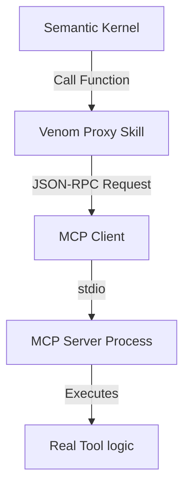

# Analiza: Import i Obsługa Narzędzi MCP z Zewnętrznych Repozytoriów (nr 101)

**Data:** 2026-01-30
**Autor:** Antigravity (Agent)
**Status:** Zakończone

---

## 1. Cel
Umożliwienie systemowi Venom korzystania z bogatego ekosystemu narzędzi zgodnych ze standardem **MCP (Model Context Protocol)**. Funkcjonalność ta ma pozwalać na pobieranie (importowanie) narzędzi z repozytoriów Git, automatyczną konfigurację i używanie ich jako natywnych umiejętności (Skills) Agenta.

## 2. Architektura Rozwiązania: "MCP Bridge"

Narzędzia MCP działają jako serwery (procesy), udostępniające funkcje przez JSON-RPC (stdio/SSE). Venom działa na Pythonowych klasach dziedziczących po `BaseSkill`. Aby je połączyć, potrzebujemy **Adaptera**.

### 2.1 Koncepcja "Proxy Skill"
Zamiast przepisywać `SkillManager`, zastosujemy wzorzec Proxy. Dla każdego zaimportowanego narzędzia MCP wygenerowany zostanie "wrapper" w Pythonie, który jest zgodny z interfejsem Venoma.

**Struktura Komponentów:**
1.  **MCP Server Process**: Działa w tle jako podproces (np. `python server.py` lub `node build/index.js`).
2.  **Venom Proxy Skill**: Klasa dziedzicząca po `BaseSkill` (z pliku `.py` w `custom/`), która:
    *   Nawiązuje połączenie z procesem MCP (stdio).
    *   Dynamicznie pobiera listę narzędzi (`list_tools`) podczas inicjalizacji.
    *   Rejestruje metody `@kernel_function` dla każdego narzędzia MCP.
    *   Przekazuje wywołania z Kernela do procesu MCP.

## 3. Workflow Użytkownika ("Jak to działa?")

1.  **Komenda Agenta**:
    > "Zaimportuj narzędzia do obsługi SQLite z oficjalnego repozytorium MCP."

    Agent wywołuje: `import_mcp_skill(git_url="https://github.com/modelcontextprotocol/servers", subdirectory="src/sqlite")`

2.  **Proces Importu (Backend)**:
    *   System klonuje repozytorium do ukrytego katalogu `venom_core/skills/mcp/_repos/sqlite`.
    *   **Detekcja Środowiska**: System wykrywa `pyproject.toml` lub `package.json`.
    *   **Instalacja Zależności**: Tworzy izolowane środowisko wirtualne (`venv`) i instaluje zależności.

3.  **Generowanie Proxy**:
    *   System generuje plik `venom_core/skills/custom/mcp_sqlite.py`.
    *   Plik ten zawiera kod boilerplate, który uruchamia serwer z odpowiedniego `venv` i wystawia go jako Skill.

4.  **Użycie**:
    *   `SkillManager` (dzięki mechanizmowi hot-reload) wykrywa nowy plik `mcp_sqlite.py`.
    *   Ładuje go i rejestruje w Semantic Kernelu.
    *   Agent widzi nowe funkcje (np. `mcp_sqlite_query_db`).

## 4. Wyzwania i Ryzyka

### 4.1 Zarządzanie Zależnościami (Dependency Hell)
*   **Problem**: Każde narzędzie MCP może wymagać innych, konfliktujących wersji bibliotek.
*   **Rozwiązanie**: **Ścisła Izolacja Venv**. Każde zaimportowane repozytorium MUSI mieć własne środowisko wirtualne (`.venv`). Proxy Skill musi uruchamiać proces serwera wskazując na interpreter z tego konkretnego venv.

### 4.2 Bezpieczeństwo (RCE)
*   **Ryzyko**: Uruchamianie kodu z nieznanych repozytoriów Git to prosta droga do przejęcia kontroli nad systemem (Remote Code Execution).
*   **Mitigacja (Standard)**:
    *   **Izolacja Venv**: Podstawowa separacja zależności. Jest lekka i szybka.
    *   **Ostrzeżenie**: Wymóg potwierdzenia instalacji repozytorium przez użytkownika.

### 4.3 Alternatywa: Konteneryzacja na Żądanie (Docker)
Ponieważ Venom pobiera kod źródłowy (`git clone`), mamy pełną elastyczność w sposobie jego uruchamiania. Konteneryzacja jest **dostępną alternatywą**, którą możemy wdrożyć w przyszłości lub jako opcję konfiguracji ("High Security Mode").

*   **Mechanizm**:
    *   Jeśli repozytorium zawiera `Dockerfile` -> Venom wykonuje `docker build`.
    *   Jeśli brak `Dockerfile` -> Venom używa generycznego obrazu (np. `python:3.12-slim`), montuje kod jako wolumen i instaluje zależności w kontenerze.
*   **Zalety**:
    *   Perfekcyjna izolacja (system plików, sieć).
    *   Brak zaśmiecania systemu hosta bibliotekami.
*   **Wady**:
    *   Dłuższy czas "zimnego startu" (pobieranie obrazów).
    *   Wymaga działającego demona Docker.

Dzięki architekturze Proxy, przejście z modelu `venv` na `docker` wymagałoby jedynie zmiany w klasie `McpProxySkill` (zmiana komendy z `python server.py` na `docker run ...`). Kod klienta pozostaje bez zmian.

## 5. Testowalność
Proxy Skill jest trudny do testowania jednostkowego, ponieważ zależy od zewnętrznego procesu.
*   **Rozwiązanie**: Stworzenie `MockMcpServer` - prostego skryptu, który udaje serwer MCP (odpowiada na JSON-RPC na stdio) do celów testowych.

## 6. Plan Implementacji (MVP)

1.  **Fundamenty**: Dodać bibliotekę `mcp` (oficjalne SDK) do `requirements.txt`.
2.  **Generator**: Stworzyć `McpProxyGenerator` - klasę tworząca pliki wrapperów `.py`.
3.  **Logika Importu**: Rozszerzyć `GitSkill` lub stworzyć `SystemSkill` o logikę `setup_venv`.
4.  **Komenda**: Dodać skill `McpManager` z funkcją `import_mcp_tool(...)`.

**Rekomendacja (Podejście "Lite"):**
Zdecydowanie rekomenduję podejście oparte na **Python venv**.
*   **Zalety**: Szybki start (brak budowania obrazów), minimalne zużycie RAM (tylko proces pythona), brak narzutu Docker Daemon.
*   **Idealne dla**: Eksperymentowania i szybkiego prototypowania.
*   **Ryzyko**: Mniejsza izolacja niż Docker, ale akceptowalna przy świadomym imporcie znanych narzędzi.
