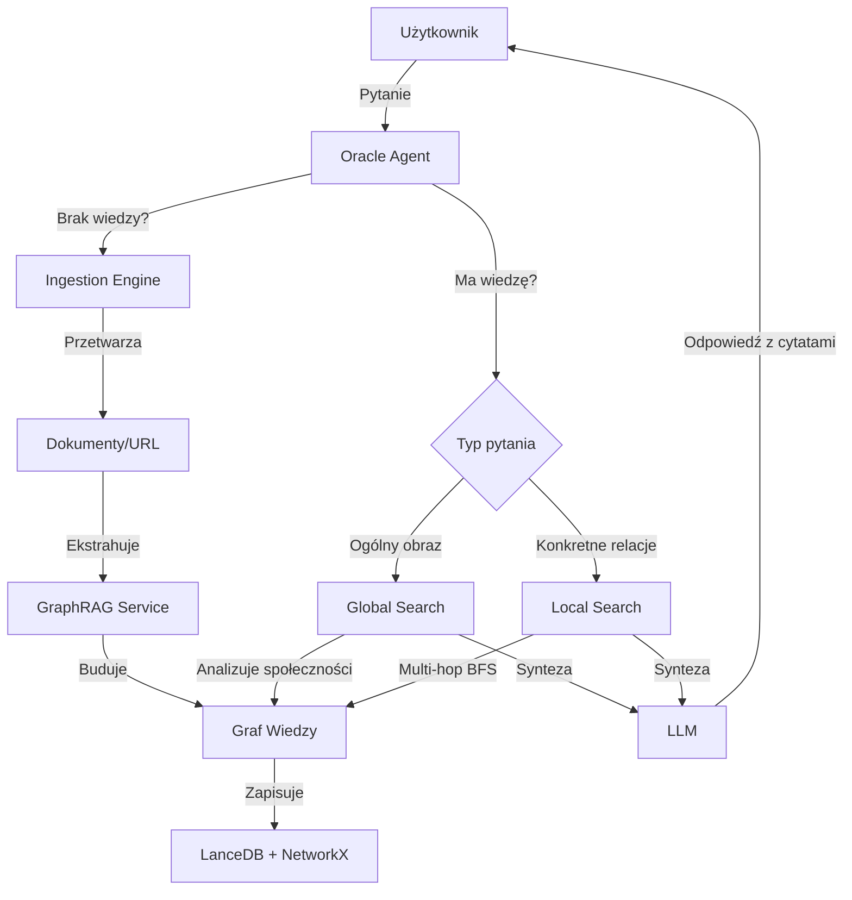

# Oracle Agent & GraphRAG - Dokumentacja

## Przegląd

System Oracle Agent to zaawansowany silnik analizy wiedzy wykorzystujący GraphRAG (Graph Retrieval-Augmented Generation) do multi-hop reasoning i głębokiej analizy dokumentów.

## Komponenty Systemu

### 1. **Ingestion Engine** (`venom_core/memory/ingestion_engine.py`)

Silnik przetwarzania wieloformatowych danych.

**Obsługiwane formaty:**
- 📄 **PDF** - używa `markitdown` lub `pypdf`
- 📝 **DOCX** - używa `markitdown` lub `python-docx`
- 🖼️ **Obrazy** (PNG, JPG, GIF, etc.) - używa Florence-2 do opisu
- 🎵 **Audio** (MP3, WAV, OGG) - używa Whisper do transkrypcji
- 🎬 **Video** (MP4, AVI, MKV) - ekstrahuje audio i transkrybuje
- 📋 **Tekst** (TXT, MD, kod źródłowy)
- 🌐 **URL** - pobiera i czyści treść stron WWW

**Kluczowe funkcje:**
- `detect_file_type(path)` - wykrywa typ pliku
- `ingest_file(path)` - przetwarza plik
- `ingest_url(url)` - przetwarza URL
- `_semantic_chunk(text)` - dzieli tekst semantycznie (nie co N znaków)

**Przykład użycia:**
```python
from venom_core.memory.ingestion_engine import IngestionEngine

engine = IngestionEngine()

# Przetwórz PDF
result = await engine.ingest_file("./documents/manual.pdf")
print(f"Chunks: {len(result['chunks'])}")
print(f"Type: {result['file_type']}")

# Przetwórz URL
result = await engine.ingest_url("https://example.com/article")
```

### 2. **GraphRAG Service** (`venom_core/memory/graph_rag_service.py`)

Zaawansowany graf wiedzy z ekstrakcją encji i relacji.

**Architektura:**
- **Węzły (Entities)**: Reprezentują pojęcia, osoby, dokumenty
- **Krawędzie (Relationships)**: Relacje między encjami (np. CREATED_BY, RELATED_TO)
- **Społeczności (Communities)**: Klastry powiązanych encji (algorytm Louvain)
- **VectorStore**: Hybrydowe wyszukiwanie (semantic + keyword)

**Kluczowe funkcje:**

```python
from venom_core.memory.graph_rag_service import GraphRAGService

graph = GraphRAGService()

# Dodaj encję
graph.add_entity(
    entity_id="python",
    entity_type="ProgrammingLanguage",
    properties={"name": "Python", "created": "1991"}
)

# Dodaj relację
graph.add_relationship(
    source_id="python",
    target_id="guido_van_rossum",
    relationship_type="CREATED_BY"
)

# Ekstrahuj wiedzę z tekstu (wymaga LLM)
await graph.extract_knowledge_from_text(
    text="Python was created by Guido van Rossum in 1991.",
    source_id="doc_1",
    llm_service=llm
)

# Global Search (pytania o ogólny obraz)
result = await graph.global_search(
    "What is this project about?",
    llm_service=llm
)

# Local Search (multi-hop reasoning)
result = await graph.local_search(
    "What is the relationship between X and Y?",
    max_hops=2,
    llm_service=llm
)
```

**Typy wyszukiwania:**

1. **Global Search**: 
   - Analizuje społeczności w grafie
   - Tworzy podsumowania klastrów
   - Dobre dla pytań typu "O czym jest ten projekt?"

2. **Local Search**:
   - Eksploruje sąsiedztwo węzłów (BFS)
   - Multi-hop reasoning (do N kroków)
   - Dobre dla pytań typu "Jaki jest związek między X a Y?"

### 3. **Oracle Agent** (`venom_core/agents/oracle.py`)

Agent analityczny wykorzystujący GraphRAG do głębokich analiz.

**Reasoning Loop:**
1. **Analiza pytania** - zrozumienie intencji użytkownika
2. **Wybór strategii** - global vs local search
3. **Eksploracja** - zbieranie faktów z grafu
4. **Synteza** - połączenie faktów w odpowiedź
5. **Weryfikacja** - cytowanie źródeł

**Dostępne funkcje (plugin):**
- `global_search(query)` - wyszukiwanie globalne
- `local_search(query, max_hops)` - wyszukiwanie lokalne
- `ingest_file(path)` - przetworzenie pliku
- `ingest_url(url)` - przetworzenie URL
- `get_graph_stats()` - statystyki grafu

**Przykład użycia:**
```python
from semantic_kernel import Kernel
from venom_core.agents.oracle import OracleAgent

kernel = Kernel()
# ... konfiguracja kernel ...

oracle = OracleAgent(kernel)

# Zadaj trudne pytanie
result = await oracle.process(
    "Jaki jest związek między agentem Ghost a modułem Florence-2?"
)
print(result)
```

### 4. **Research Skill** (`venom_core/execution/skills/research_skill.py`)

Skill do ingestii danych używany przez agentów.

**Funkcje:**
- `digest_url(url)` - pobiera i dodaje URL do grafu
- `digest_file(path)` - przetwarza plik
- `digest_directory(path, recursive)` - przetwarza katalog
- `get_knowledge_stats()` - statystyki grafu

**Przykład użycia:**
```python
from venom_core.execution.skills.research_skill import ResearchSkill

skill = ResearchSkill()

# Dodaj plik
result = await skill.digest_file("./docs/manual.pdf")

# Dodaj cały katalog
result = await skill.digest_directory(
    "./docs/api",
    recursive=True
)

# Sprawdź statystyki
stats = skill.get_knowledge_stats()
print(stats)
```

## Instalacja Zależności

```bash
# Podstawowe zależności (już w requirements.txt)
pip install networkx lancedb

# Ingestia dokumentów
pip install pypdf markitdown python-docx

# Web scraping
pip install trafilatura beautifulsoup4

# Vision (opcjonalne)
# Florence-2 jest już w projekcie

# Audio (opcjonalne)
pip install faster-whisper
```

## Przykłady Użycia

### Przykład 1: Analiza dokumentacji PDF

```python
import asyncio
from semantic_kernel import Kernel
from venom_core.agents.oracle import OracleAgent

async def analyze_pdf():
    kernel = Kernel()
    # ... konfiguracja ...
    
    oracle = OracleAgent(kernel)
    
    # Przetwórz PDF
    await oracle.process(
        "Przeczytaj plik ./docs/washing_machine_manual.pdf i dodaj do grafu wiedzy"
    )
    
    # Zadaj pytanie
    result = await oracle.process(
        "Dlaczego miga czerwona dioda w pralce?"
    )
    
    print(result)

asyncio.run(analyze_pdf())
```

### Przykład 2: Multi-Hop Reasoning

```python
# Po przetworzeniu dokumentacji projektu...

result = await oracle.process(
    "Jaki jest związek między agentem Ghost a modułem Florence-2? "
    "Wyjaśnij krok po kroku łańcuch zależności."
)

# Oracle odpowie np.:
# "1. Agent Ghost używa Input Skill
#  2. Input Skill korzysta z Vision Grounding
#  3. Vision Grounding jest powered by Florence-2
#  [Źródła: ...]"
```

### Przykład 3: Persistent Knowledge Base

```python
# Buduj graf wiedzy stopniowo...

# Dzień 1: Dodaj dokumentację
await oracle.process("digest_file ./docs/api_spec.pdf")
await oracle.process("digest_url https://docs.python.org/3/")

# Dzień 2: Graf jest zapisany automatycznie
# Możesz zadawać pytania bez ponownej ingestii
result = await oracle.process(
    "Jak zaimplementować autoryzację zgodnie ze specyfikacją API?"
)
```

## Workflow Typowego Użycia



## Performance & Optymalizacja

### Chunking Semantyczny
- Zamiast ciąć tekst co 500 znaków, dzielimy logicznie:
  - Po akapitach (`\n\n`)
  - Po zdaniach (`. `)
  - Po klauzulach (`, `)

### Lazy Loading
- Vision Engine (Florence-2) ładowany tylko gdy potrzebny
- Audio Engine (Whisper) ładowany tylko gdy potrzebny

### Cache
- Społeczności (communities) są cache'owane
- Graf jest zapisywany po każdej operacji

### Koszty LLM
- Ekstrakcja wiedzy: ~500-3000 tokenów na dokument
- Global search: ~1000-2000 tokenów na zapytanie
- Local search: ~500-1500 tokenów na zapytanie
- **Optymalizacja**: Używaj tańszego modelu (Phi-3, Mistral) do ekstrakcji, GPT-4o do syntezy

## Troubleshooting

### "No module named 'markitdown'"
```bash
pip install markitdown
# lub
pip install pypdf  # fallback
```

### "Vision Engine niedostępny"
- Florence-2 wymaga GPU lub może być wolny na CPU
- Można pominąć obrazy lub użyć tylko opisu nazwy pliku

### "Audio Engine niedostępny"
```bash
pip install faster-whisper
```

### Graf wiedzy jest pusty
```python
# Sprawdź czy pliki zostały przetworzone
stats = graph.get_stats()
print(stats)

# Sprawdź czy graf został załadowany
graph.load_graph()
```

## Roadmap (Przyszłe Funkcje)

- [ ] **Dashboard Knowledge Explorer** - wizualizacja grafu (vis.js/cytoscape.js)
- [ ] **Incremental Updates** - aktualizacja grafu bez przebudowy
- [ ] **Query Expansion** - automatyczne rozszerzanie zapytań
- [ ] **Temporal Knowledge** - śledzenie zmian w czasie
- [ ] **Multi-Graph** - wiele grafów wiedzy (osobiste, projektowe, publiczne)
- [ ] **Export/Import** - eksport do Neo4j, RDF, etc.

## FAQ

**Q: Czy mogę używać Oracle bez GPT-4?**
A: Tak! Możesz używać lokalnych modeli (Ollama, vLLM). Ekstrakcja wiedzy i reasoning będą działać, choć mogą być mniej precyzyjne.

**Q: Jak długo trwa przetworzenie 100-stronicowego PDF?**
A: ~30-60 sekund (zależy od prędkości LLM i jakości PDF).

**Q: Czy graf jest persistent?**
A: Tak, graf jest zapisywany do `data/memory/knowledge_graph.json` i ładowany automatycznie.

**Q: Czy mogę używać Oracle w API?**
A: Tak, Oracle jest agnetem i może być wywoływany przez FastAPI endpoint.

**Q: Multi-hop reasoning - ile "skoków" mogę zrobić?**
A: Parametr `max_hops` kontroluje głębokość (domyślnie 2). Więcej skoków = więcej kontekstu, ale dłuższe zapytania.

## Licencja

Ten moduł jest częścią projektu Venom i podlega tej samej licencji co cały projekt.
